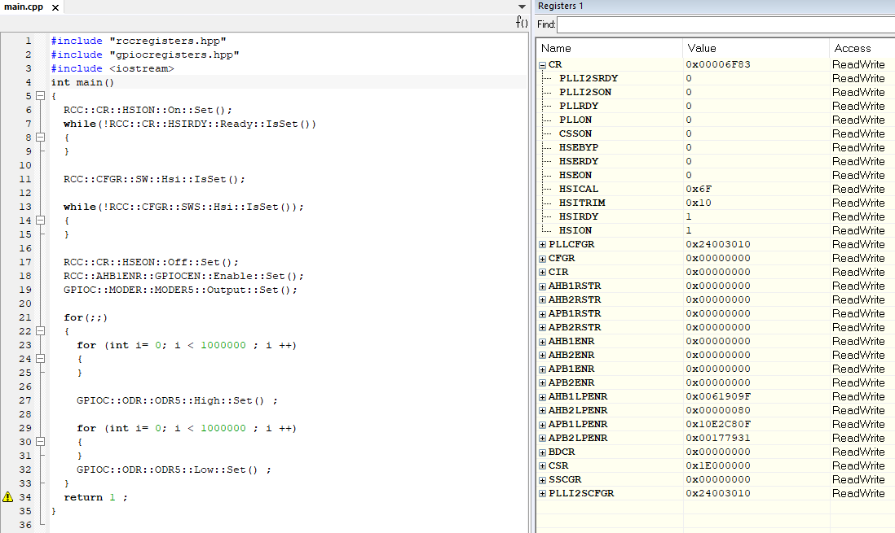
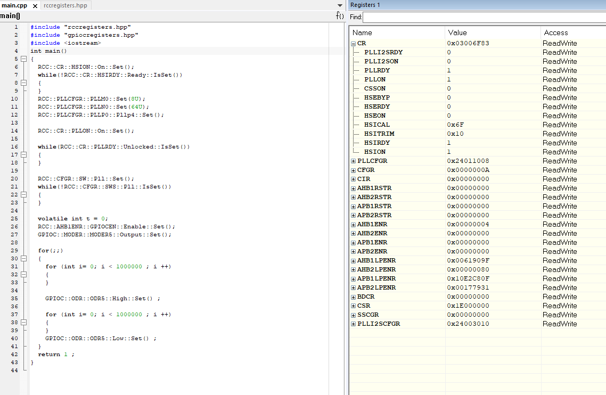

*Задание*: Настроить внешний источник частоты HSE и подключить его на системную шину.
Прошить программу морганиями светодиодом - проверить, что они моргают. Код и запуск программы представлен на рисунке:

.Установка Hse
image::Photos/Hse.png[]

После запуска программы светодиод, расположенный на плате, начал мограть.

*Задание*: Настроить внутренний источник частоты HSI и подключить его на системную шину.
Прошить программу морганиями светодиодом - проверить, что они моргают быстрее в 2 раза

.Установка Hsi

После запуска программы можем заметить, что светодиод на плате начал мограть в два раза быстрее,
чем в первом случае.

Задание:

Настроить PLL источник тактовой частоты на 32 Мгц и подключить его на системную шину.

Прошить программу морганиями светодиодом - проверить, что они моргают  еще в 2 раза
быстрее чем в пункте 2.

.Установка Pll

*Вывод*: светодиод стал моргать ещё быстрей, чем во втором пункте.

== *Вопросы*

*1) POD* *типы* в языке _C++_ это аббревиатура от _“Plain Old Data”_, что можно трактовать как «Простые данные в стиле _C_»

**2) **Простые:

· целые (_bool, char, int, enim, long, short, long long_)

· с плавающей точкой (_float, double, long double_)

· структурированные (_array, union, class/structure_)

· адресные (_pointer, reference_)

*3)* Можем определить свой тип сами, либо сделать псевдоним типа. Любой класс или структура, определенная нами, будет являться нашим типом. Пользовательский тип делается вручную и может иметь любой псевдоним.

*4)* _short int_ – целочисленное знаковое значение укороченной длины,

_unsigned short int_ – целочисленное беззнаковое значение укороченной длины,

_long int_ – выбор по умолчанию для целочисленных значений. На платформах на которых int равен по длине unsigned short int может быть длиннее int,

_unsigned long int_ – целое число двойной длины. На платформах на которых int равен по длине unsigned short int может быть длиннее int,

_long double_ – число с плавающей точкой двойной точности с двойной точностью

*5)* Размеры типов не четко определены и могут отличаться для различных микроконтроллеров. Для размеров типов существует правило:

    1 <= sizeof(char) <= sizeof(short) <= sizeof(int) <= sizeof(long)
    1 <= sizeof(bool) <= sizeof(long)
    sizeof(char) <= sizeof(long)
    sizeof(float) <= sizeof(double) <= sizeof(long double)
    sizeof(T) == sizeof(signed T) == sizeof(unsigned T)

*6)* Данный унарный оператор используют для вычисления и возвращает размер определённой переменной или определённого типа данных в байтах

*7)* _std::size_t_ – целочисленный беззнаковый тип результата, возвращаемого
операторами sizeof. Может хранить максимальный размер теоретически
возможного объекта любого типа (включая массивы). С++ определяет size_t в пространстве имен std.

*8) Назовите фиксированные типы целых в библиотеке _std_.*

Чтобы решить вопрос кроссплатформенности, в язык С++
добавили набор целочисленных типов фиксированного размера,
которые гарантированно имеют один и тот же размер на любой архитектуре.

*9) Что такое псевдоним типа?*

Средство языка программирования _C++_,
введённое в синтаксис для повышения
удобства обращения к пользовательским
и встроенным типам данных.

*10) Что такое явное и неявное преобразование типа?*

Преобразование значения
переменной одного типа в значение
другого типа называется приведение типа
и бывает явным и неявным.
При явном приведении перед выражением следует
указать в круглых скобках имя типа, к которому
необходимо преобразовать исходное значение.
При неявном приведении преобразование происходит
автоматически, по правилам, заложенным в языке Си.

*11) Какие явные преобразования типов вы знаете?*

_static_cast, const_cast, reinterpret_cast, dynamic_cast_

Использовали мы два типа явного преобразования: _reinterpret_cast_ и _static_cast_.

*12) Что делает reinterpret_cast?*

_reinterpret_cast_ преобразует типы, несовместимыми друг с другом, и используется для преобразования:

- В свой собственный тип

- Указателя в интегральный тип

- Интегрального типа в указатель

- Указателя одного типа в указатель другого типа

- Указателя на функцию одного типа в указатель на функцию другого типа

**13) Чем _static_cast_ отличается от _reinterpret_cast_? **

_static_cast_ - это приведение от одного типа к другому,
которое (интуитивно) является приведением, которое при определенных
обстоятельствах может быть успешным и иметь смысл в отсутствие опасного приведения.

A _reinterpret_cast_ - это приведение, которое представляет собой небезопасное преобразование,
которое может переинтерпретировать биты одного значения как биты другого значения.

*14) Что такое ОЗУ и ПЗУ?*

*ОЗУ* - оперативное запоминающее устройство;

*ПЗУ* - постоянное запоминающее устройство.

*ОЗУ* является энергозависимой памятью,
которая временно хранит файлы, с которыми работаем.

*ПЗУ* является энергонезависимой памятью,
которая постоянно хранит служебные команды компьютера.

*15) Каков размер памяти ARM Cortex микроконтроллеров.*

Ядро _ARM_ имеет 4 Гбайт последовательной памяти с адресов _0x00000000_ до _0xFFFFFFFF_.

*16) По какой архитектуре разработан ARM Cortex микроконтроллер?*

Микроконтроллер на ядре _Cortex M4_ выполнен по _модифицированной Гарвардской архитектуре_,
которая представляет по строению общую шину данных и шину адреса для
всех внешних данных, внутри
процессора использовуется шина данных, шина команд и две шины адреса.

*17) В чем отличие Гарвардской архитектуры от Архитектура ФонНеймана?*

Их основное отличие заключалось в том,
что архитектура *Фон Неймана* использует общую шину данных и команд, а *Гарвардская*
предполагает наличие нескольких шин
(в оригинале две: шина данных и шина команд).

*18)* Локальные переменные функции создаются на стеке или в регистрах

*19)* инициализируемые - .data инициализируемые нулем - .bss данные переменные не изменяются до конца работы приложения.

*20)* инициализируемые - .data

инициализируемые нулем - .bss

*21)* *Стек* – это организация памяти, выполненная компоновщиком. На уровне микроконтроллера для работы со стеком есть специальные ассемблерные команды (например PUSH – положить регистры в стек, и POP – взять из стека).

Так же для сохранения и считывания данных из стека могут использоваться инструкции STR и LDR.

*22) Указатель* - это переменная, которая хранит адрес какой-то другой переменной.

*23)* Операция, нужная для того, чтобы получить значение, записанное в некоторой области, на которое ссылается указатель

*24)* Оператор _&_ - оператор взятия адреса.

& перед переменной передает адрес по которому лежат значения этой переменной.

*25)* Указатели можно складывать+, вычитать -, увеличивать ++, сравнивать !=. Но указатели должны быть одного типа

*26) Что такое константный указатель?*

*Константный указатель* — это указатель,
значение которого не может быть изменено после инициализации.
Для объявления константного указателя используется ключевое слово
_const_ между звёздочкой и именем указателя.

*27) Что такое указатель на константу?*

*Указатель на константное значение* — это неконстантный
указатель, который указывает на неизменное значение. Для объявления указателя
на константное значение, используется ключевое слово _const_ перед типом данных.

*28) Что такое ссылка? В чем её отличие от указателя?*

_Ссылка_ не является _указателем_, а просто является другим
именем для объекта. Главное отличие _ссылки_ от _указателей_:
_указатель_ это целое число, для ссылки доступны только 2 операции:
копирование и разыменование. В языках программирования
_ссылка_ может быть реализована как переменная, содержащая адрес ячейки памяти.

*29) Что такое регистр?*

*Регистр* — устройство для записи, хранения и считывания
n-разрядных двоичных данных и выполнения других операций над ними.

*30)Что такое регистры общего назначения?*

*Регистры общего назначения* - это
сверхбыстрая память внутри процессора,
предназначенная для хранения адресов и промежуточных
результатов вычислений (регистр общего назначения/регистр данных)
или данных, необходимых для работы самого процессора.

Регистры общего назначения расположены внутри ядра микроконтроллера(сверхбыстрая память).

*31) Что такое регистры специального назначения?*

*Регистры специального назначения* расположены в ОЗУ микроконтроллера и используются для управления процессором и периферийными устройствами.

Каждый регистр в архитектуре _ARM_ представляет собой ресурс памяти
и имеет длину в _32_ бита, где каждый бит можно представить в виде выключателя
с помощью которого осуществляется управление тем или иным параметром микроконтроллера.

*32) Как можно установить бит в регистре специального назначения?*

Регистры специального назначения используются для управления микроконтроллером и его периферией.

Регистр специального назначения является ячейкой памяти, а установить бит в ней
можно через операцию *|=*

_*reinterpret_cast<uint32_t*>(REGISTER_ADDR) |= (1 << BIT_NUM) ;_

*33) Объясните как вызывается функция.*

При вызове функции происходит примерно следующее:

- в стек помещается фрейм, содержащий:

1. обратный адрес (адрес инструкции, следующей за вызовом функции);

2. Аргументы функции, передаваемые через стек;

3. Память под локальные переменные;

4. Сохраненные копии всех регистров, модифицированных функцией, которые необходимо будет восстановить после того, как функция завершит свое выполнение.

- в оперативные регистры записываются аргументы функции, передаваемые через них;

- процессор переходит к точке начала выполнения функции.

*34) Что такое трансляция?*

*Трансляция* - это преобразование программы, представленной на одном из языков
программирования, в программу на другом языке,
в определенном смысле равносильную первой.

*35) Что такое компоновка?*

*Компоновка* - это один из этапов создания исполняемого файла.
*Компилировать* – проводить трансляцию машинной программы с проблемно-ориентированного языка на
машинно-ориентированный язык (создание объектного кода) для ее исполнения.

*36) Как лучше организовывать структуру проекта и почему?*

При создании структуры проекта стоит соблюдать иерархическую структуру файлов.
Это позволяет облегчить поиск требуемых компонентов.
Все существующие подгруппы разбивают файлы на логические группы.

.Правильные структуры проекта
image::Photos/5.png[]
.Правильные структуры проекта
image::Photos/6.png[]

*37) Что такое операторы?*

*Оператор* — это элемент языка, задающий полное описание действия,
которое необходимо выполнить. Каждый оператор представляет собой
законченную фразу языка программирования и определяет некоторый вполне
законченный этап обработки данных. В состав операторов могут входить
служебные слова, данные, выражения и другие операторы. В английском языке
данное
понятие обозначается словом _“statement”_, означающим также _“предложение”_.

*38)* Операция, присваивание, сложение,вычитание, унарный плюс, унарный минус, деление, умножение, остаток от деления и т.д.

*39)* Логическое отрицание, логическое сложение, логическое умножение.

*40)* Побитовая инверсия, побитовое И, побитовое ИЛИ,побитовое исключающее ИЛИ, побитовый сдвиг влево,вправо.

*41) Пример переопределения опреатора:*

    poly operator+(poly T) // Переопределение сложения - конвейер значений
    {
    T.add(*this);      // Второй операнд по значению (копия)
    return T;          // Добавление первого к копии второго
    }

*42)* Составное присваивание, операторы работы с указателями и членами класса, функторы, тернарные операции,
sizeof(), запятая, приведение типа, new.

*43) Как сбросить бит с помощью битовых операторов?*

_x &= ~(1 << номер бита)_

*44) Как установить бит с помощью битовых операторов?*

_x |= (1 << номер бита)_

*45) Как поменять значение бита с помощью битовых операторов?*

_x ^= (1 << номер бита)_

*46) Какой микроконтроллер на отладочной плате XNUCLE ST32F411?*

На отладочной плате _XNUCLE ST32F411_ находится микроконтроллер _ST32F411RE_.

*47) Какие блоки входят в состав микроконтроллера STM32F411?*

Функциональные блоки микроконтроллера _STM32F411_ представлены ниже:

.Функциональные блоки микроконтроллера STM32F411
image::Photos/10.png[]

48) Присутствие аппаратного модуля работы с плавающей точкой, присутствие набора инструкций DSP, SIMD, FP.

49) *STM32F411* – линейка с оптимизированной динамической потребляемой мощностью и увеличенным объемом ОЗУ (до 128 кбайт). Максимальная рабочая частота этих микроконтроллеров достигает 100 МГц.

50) Настраиваемые источники тактовой частоты, настраиваемые на различные функции порты, внутренний температурный сенсор ,таймеры с настраиваемым модулем ШИМ
DMA для работы с модулями (SPI, UART, ADC… ) ,12 разрядный ADC последовательного приближения ,Часы реального времени
,системный таймер и спец. прерывания для облегчения и ускорения работы ОСРВ.

*51) Какие источники тактирования есть у микроконтроллера STM32F411*

Для формирования системной тактовой частоты SYSCLK могут использоваться 4 основных источника:​

- HSI (high-speed internal) — внутренний высокочастотный RC-генератор.​

- HSE (high-speed external) — внешний высокочастотный генератор.​

- PLL — система ФАПЧ. Представляет собой набор из умножителей и делителей, исходный
сигнал он получает от HSI или HSE, а на выходе формирует другую частоту.

- LSI (low-speed internal) — внутренний низкочастотный генератор.

- LSE (low-speed external) — внешний низкочастотный генератор.

*52) Алгоритм настройки частоты*

Определить какие источники частоты нужны

Например, PLL нужен для USB

Включить нужный источник

Используя _Clock Control register (RCC::CR)_

Дождаться стабилизации источника

Используя соответствующие биты _(..RDY) Clock Control register (RCC::CR)_

Назначить нужный источник на системную частоту

Используя _Clock Configuration Register (RCC::CFGR)_

Дождаться пока источник не переключиться на системную частоту

Используя _Clock Configuration Register (RCC::CFGR)_

*53) Что такое ФАПЧ?*

_ФАПЧ_ - система автоматического регулирования, подстраивающая фазу
управляемого генератора так, чтобы она
была равна фазе опорного сигнала, либо отличалась на известную функцию от времени.

*54) Что делает следующий код?*

    int main()
    {
        int StudentUdacha = 10;
        int PrepodUdachca = 0 ;
        StudentUdacha =  StudentUdacha ^ PrepodUdachca ;
        PrepodUdachca =  StudentUdacha ^ PrepodUdachca ;
        StudentUdacha ^= PrepodUdachca ;
    }

Сначала присваиваем переменной _StudentUdacha_ значение _10_ (1010).

Затем присваиваем переменной _PrepodUdachca_ значение _0_ (0).

С помощью операции исключающего ИЛИ запишем в переменную _StudentUdacha_
значение 10 (1010)

Далее, в переменную _PrepodUdachca_ с помощью операции исключающего ИЛИ запишем
значение 10 (1010)

В конце, используем инверсию и получаем, что в переменную _StudentUdacha_ записалось
значение 0.

С помощью данного кода можно поменять
местами значения переменных без использования буферной переменной.
